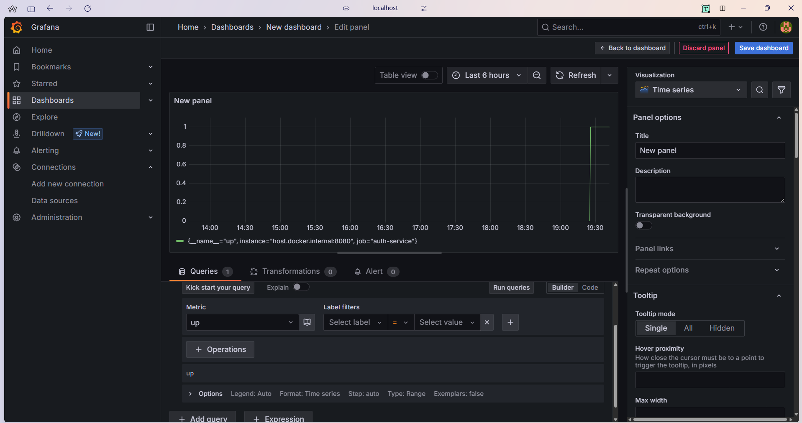
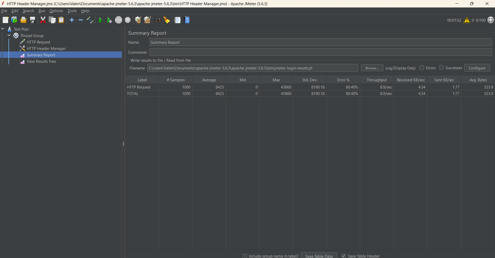
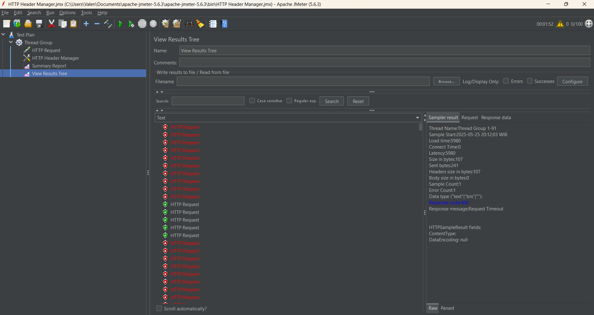
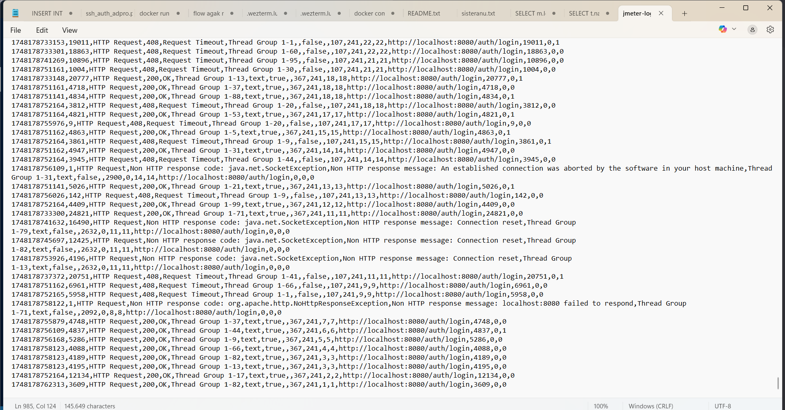

Authentication Feature by Valentino Kim Fernando

### Monitoring

Link Commit:
https://github.com/Kelompok-A12-Adpro/auth/commit/3b7d7e4194acd5daf2236b3498f5b1c646f71644
Justifikasi:
- Saya menggunakan actix-web-prom karena ringan dan langsung kompatibel dengan Actix Web yang saya gunakan di repository auth

- Menyediakan endpoint /metrics yang dapat di-scrape Prometheus → Grafana.

- Built-in HTTP metrics karena otomatis mencatat: api_requests_total, api_request_duration_seconds, api_requests_in_flight. tanpa perlu log custom tambahan

### Profiling

Profiling dilakukan menggunakan Apache JMeter untuk menguji performa endpoint POST pada `/auth/login` karena merupakan bagian krusial dalam proses autentikasi. Pengujian dilakukan dengan 100 thread (simulasi pengguna) dan 10 loop, menghasilkan total 1000 request ke server lokal.

Berdasarkan hasil file .jtl, hanya sebagian kecil request yang berhasil (200 OK), sementara mayoritas gagal dengan 408 Request Timeout atau NoHttpResponseException, menandakan server tidak mampu menangani beban secara paralel. Hal ini terjadi karena proses verifikasi password menggunakan `bcrypt::verify()` dijalankan secara blocking, menyebabkan kehabisan thread di Actix Web. 

Untuk mengatasi hal ini, perlu dilakukan optimalisasi dengan menjalankan hashing di `web::block`, menambah jumlah worker thread pada server, dan menerapkan rate limiting pada endpoint login.